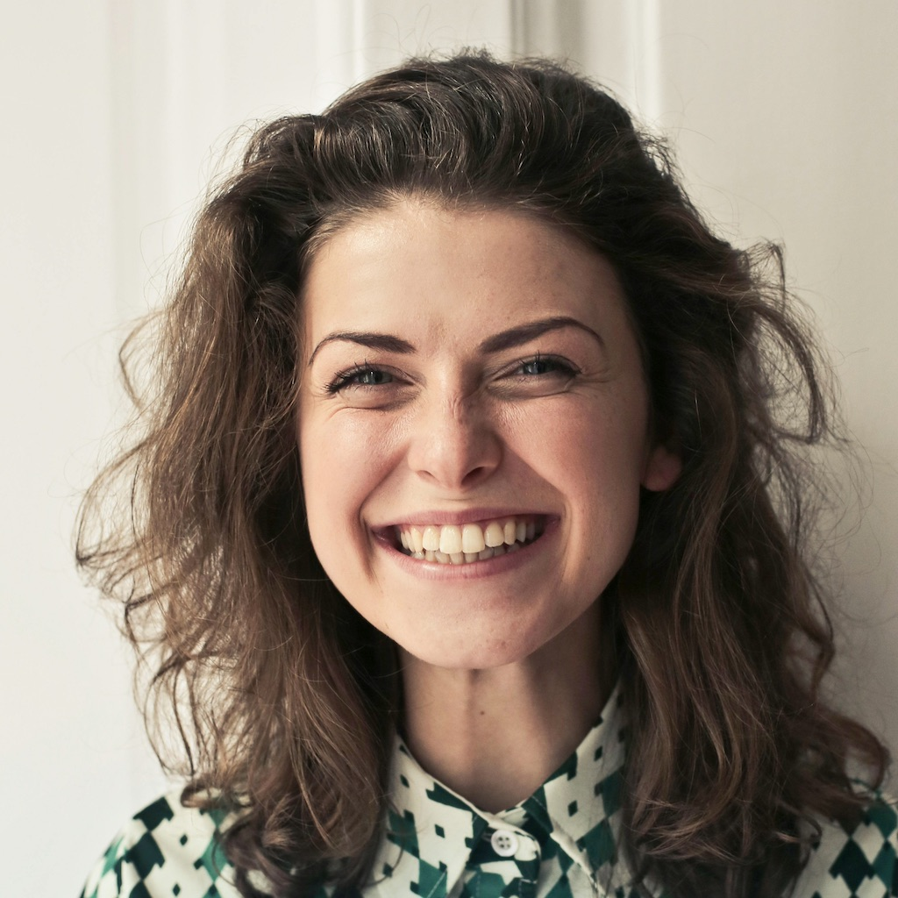

# Maria Rodriguez

- **Demographics**
  <br>
  Female, 29 years old, professional caretaker, resides in Lyon

- **Background:**
  <br>
  Maria Rodriguez is a dedicated professional caretaker with 7 years of experience. She provides
  assistance to seniors in their daily activities, ensuring their well-being and comfort. Maria values building
  meaningful connections with her clients and is committed to creating a positive and supportive environment.

- **Goals and Motivations:**
  <br>
  Maria's primary goal is to offer compassionate care to seniors, supporting them in their
  daily routines. She is motivated by the opportunity to make a positive impact on the lives of those she cares for.

- **Challenges and Pain Points:**
  <br>
  Maria faces challenges related to coordinating care schedules, managing multiple
  clients, and addressing specific health or mobility needs. She is motivated to find efficient solutions to enhance the
  caregiving experience.

- **Tech Proficiency:**
  <br>
  Maria is proficient in using digital tools for scheduling, communication, and accessing relevant
  health information about her clients.

## Information

```json
{
  "firstName": "Maria",
  "lastName": "Rodriguez",
  "email": "maria.rodriguez@yopmail.fr",
  "password": "jxPBx1F8iK6ZleoW",
  "birthdate": "1994-08-15",
  "address": {
    "street": "15 Quai Jean Moulin",
    "postalCode": "69001",
    "city": "Lyon",
    "country": "France"
  }
}
```

## Avatar


> Photo by Andrea Piacquadio: https://www.pexels.com/photo/woman-in-collared-shirt-774909/
